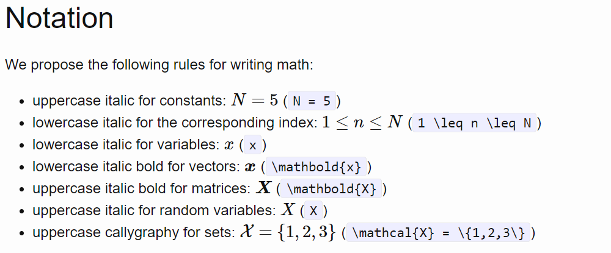

# Chemical Data Generation
Repository for doctoral research on machine learning for data generation, with applications in chemical data generation and classification.

<!---
Notes on terminology:
Instead of lab-generated spectra - EXPERIMENTAL spectra
Instead of synthetic spectra - IN-SILICO spectra
Instead of machine - INSTRUMENT
--->
<!---
GitHub resources:
https://www.gitkraken.com/learn/git/git-flow
https://nvie.com/posts/a-successful-git-branching-model/
--->

## Steps to run this repo:
1. Set up virtual environment using ```python3 -m venv your_env_name``` for Linux or ```python -m venv your_env_name``` for Windows. Activate new virtual env with ```source your_env_name/bin/activate``` for macOS/Linux ```.\your_env_name\Scripts\activate``` for Windows. 
  - If using micromamba:
    - Create with ```micromamba create -n your_env_name python=3.10```.
    - Activate with ```micromamba activate your_env_name```.
<!-- 2. Make sure Python interpreter is pointing to: ```/path/to/your/project/venv/bin/python``` -->
2. Install packages using ```pip install -r requirements.txt```. Verify correct installation with ```pip list```.
3. Add virtual environment to ```.gitignore``` as it is unnecessary for GitHub to track.
4. Create new kernel using ```python -m ipykernel install --user --name=your_kernel_name```.
5. If necessary, update git config with username and email using ```git config --global user.name "Your Name"``` and ```git config --global user.email "youremail@example.com"```.

## Steps to run on Turing:
1. ssh into turing account and run commands ```sinteractive``` and ```tmux```.  (```tmux kill-server``` to kill all existing tmux sessions)
2. Activate virtual env using one of the commands above.
3. To run jupyter notebooks and save output to notebook file: jupyter nbconvert --to notebook --execute --inplace notebook_name.ipynb

## Steps to set up ssh:
1. Use ```nano config``` to update config file (likely at ~/.ssh/config) with:
  Host [host_nickname]
    HostName [host address, like: turing.wpi.edu]
    User [username]
2. Eliminate need to enter passphrase by:
* starting ssh agent with ```eval "$(ssh-agent -s)"```.
* adding your ssh key with ```ssh-add ~/.ssh/id_rsa```.
3. ssh into vm with ```ssh host_nickname```.


## Notation:
Mathematical notation rules applied throughout this project are taken from [this](https://wookai.github.io/paper-tips-and-tricks/math.html) article.

